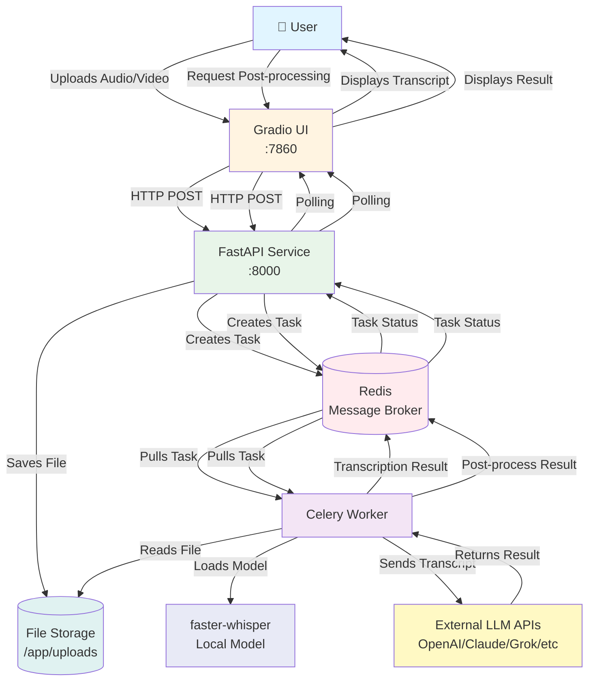

# GorgScriber POC

GorgScriber POC is a dockerized service for local transcription of lectures and meetings with a multilingual UI and smart post-processing.

## Features

- **Local Transcription:** All transcription is done locally using faster-whisper, ensuring privacy and security. Your audio and video files are never sent to external services.
- **Multilingual UI:** The user interface supports English, German, French, Russian, and Chinese.
- **Intelligent Post-processing:**
    - **For Lectures:** Generate summaries, structured plans, key term lists, and Q&A based on the transcript.
    - **For Meetings:** Create summaries, protocols, and task lists.
- **LLM Integration:** Post-processing can leverage cloud-based LLMs like OpenAI, Claude, Grok, and OpenRouter.

## Architecture

The service consists of several microservices working together:



### Components

1. **Gradio UI** (`ui/app.py`): Web interface for file uploads, transcription requests, and result display. Supports multiple languages (EN, DE, FR, RU, ZH).

2. **FastAPI Service** (`api/main.py`): REST API that handles:
   - File uploads and storage
   - Video-to-audio conversion (using ffmpeg)
   - Task creation for transcription and post-processing
   - Task status polling endpoints

3. **Celery Worker** (`api/tasks.py`): Background task processor that:
   - Transcribes audio using faster-whisper (local, CPU-based)
   - Performs post-processing using external LLM APIs
   - Returns results via Redis backend

4. **Redis**: Message broker and result backend for Celery tasks.

5. **File Storage**: Shared volume for uploaded files and extracted audio.

### Workflow

1. **Transcription Flow:**
   - User uploads audio/video file through UI
   - UI sends file to FastAPI service
   - API saves file, extracts audio if needed (video → WAV)
   - API creates Celery task and returns task_id
   - Celery worker picks up task, loads Whisper model, transcribes
   - UI polls for status and displays transcript when ready

2. **Post-processing Flow:**
   - User selects processing type (summary, plan, terms, etc.) and LLM provider
   - UI sends transcript and parameters to API
   - API creates post-processing Celery task
   - Worker sends transcript to selected LLM API
   - LLM returns processed result
   - UI polls and displays the result

### Data Flow

- **Audio/Video Files**: Stored locally, never sent to external services
- **Transcripts**: Generated locally, only text is sent to LLM APIs for post-processing
- **Models**: Whisper models are cached locally after first download

## Getting Started

### Prerequisites

- Docker
- Docker Compose

### Installation

1.  **Clone the repository:**

    ```bash
    git clone https://github.com/your-username/gorgscriber.git
    cd gorgscriber
    ```

2.  **Create and configure the environment file:**

    ```bash
    cp .env.example .env
    ```

    Open the `.env` file and add your API keys for the LLM providers you want to use. Local transcription will work without any API keys.

3.  **Build and run the application:**

    The first time you run the application, it will download the necessary models, which may take some time.

    ```bash
    docker compose up --build
    ```

    For subsequent launches, you can use:

    ```bash
    docker compose up
    ```

4.  **Access GorgScriber:**

    Open your web browser and navigate to `http://localhost:7860`.

## Important Notes

-   **Transcription is always local.** Your audio and video files are not sent to any external services.
-   **LLM post-processing uses external APIs** but only sends the text transcript, not the original audio or video.
